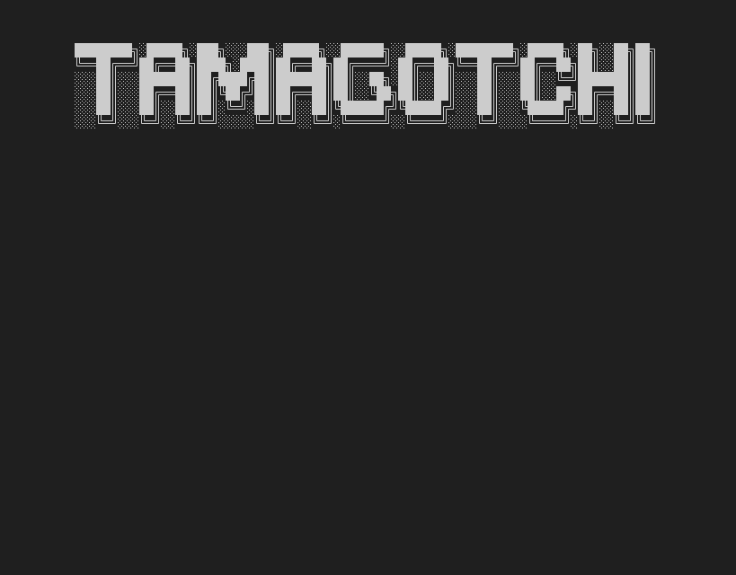
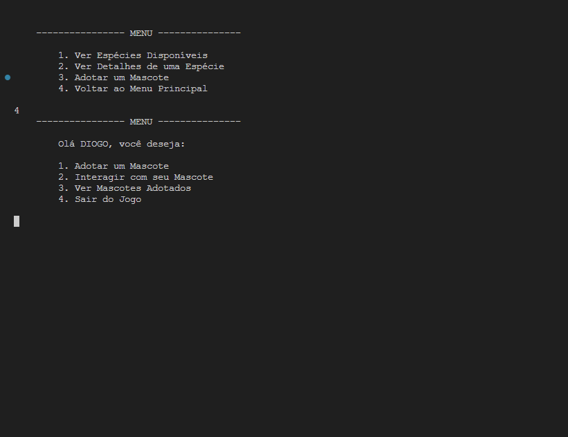

# 👾 Tamagotchi - C#

 

## Sobre o projeto

Uma aplicação console em C# e .NET 8 que se conecta à API [Pokemon API](https://pokeapi.co/docs/v2) para buscar informações sobre os adoráveis monstrinhos de bolso. Esta aplicação permite ao usuário adotar um ou mais pokémons para cuidar, podendo alimentá-los, acariciá-los, brincar e até mesmo colocá-los para dormir.

## Habilidades desenvolvidas

- Durante o desenvolvimento do projeto, apliquei habilidades em programação orientada a objetos e manipulação de dados utilizando C#. A integração com a API externa exigiu compreensão do seu funcionamento, estabelecimento de comunicação eficaz e processamento dos dados recebidos.
- Também criei animações utilizando o método Thread.Sleep e imagens em ASCII art. Foi nesse momento que pude colocar em prática meus conhecimentos em manipulação de strings e técnicas de animação.
  
 

## Técnologias utilizadas

- C# Language
- .Net 8
- MVC
- PokéAPI
- Json

